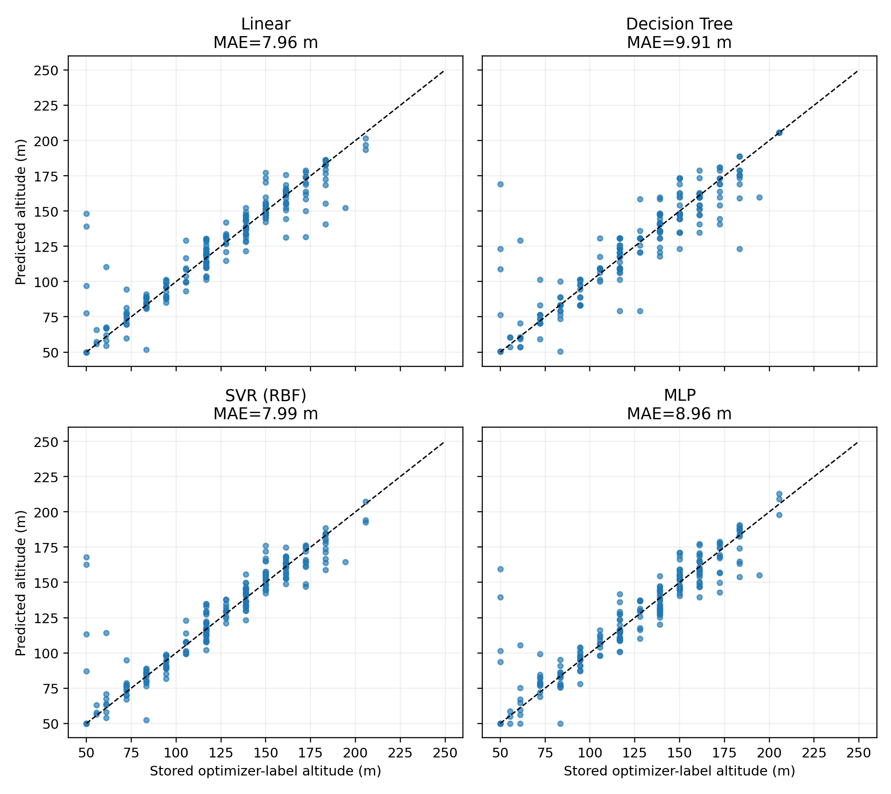
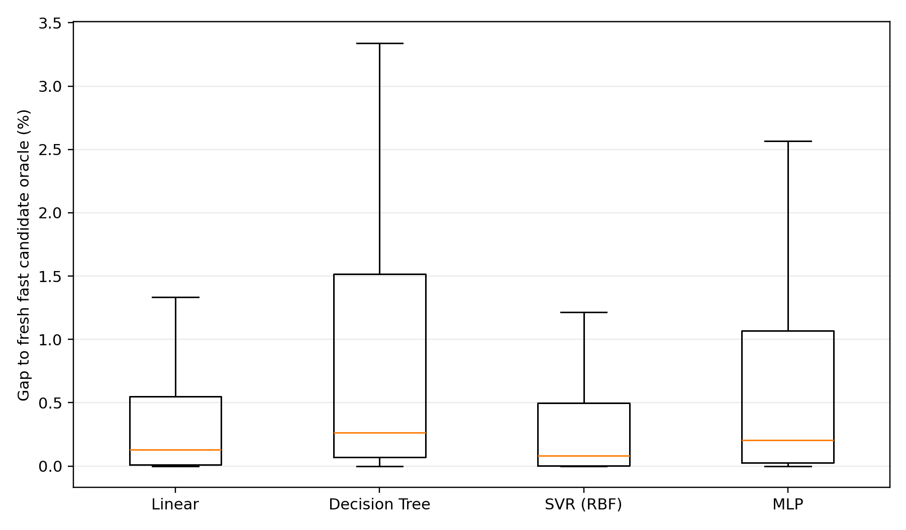
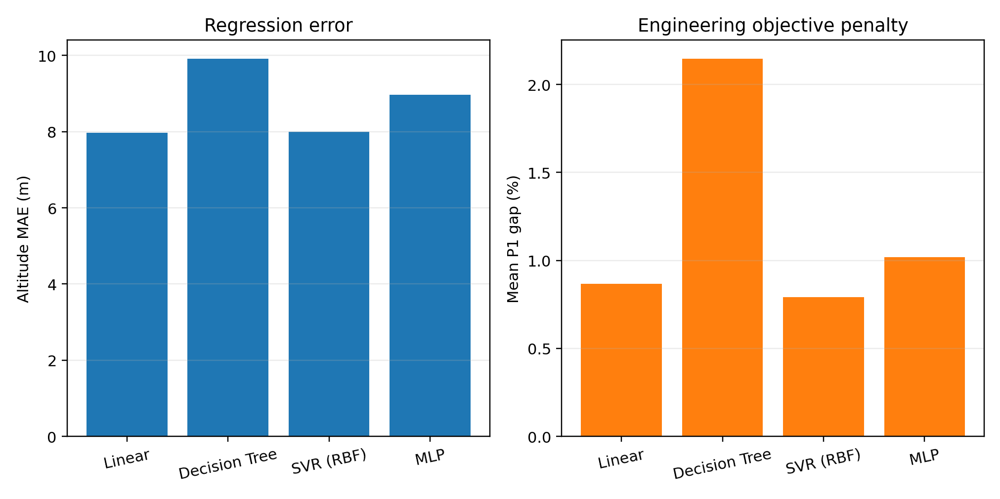
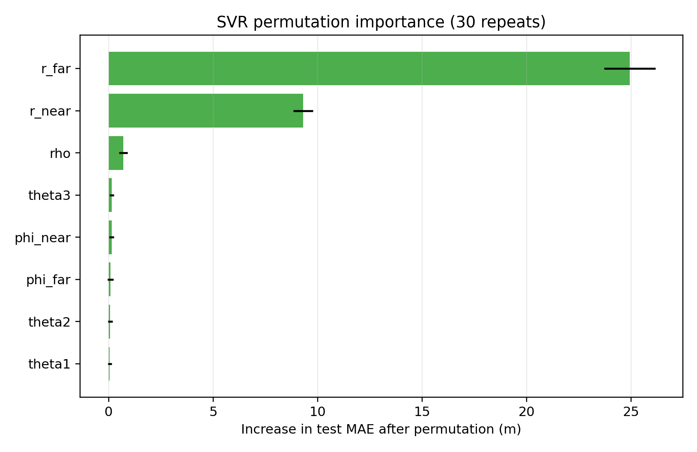
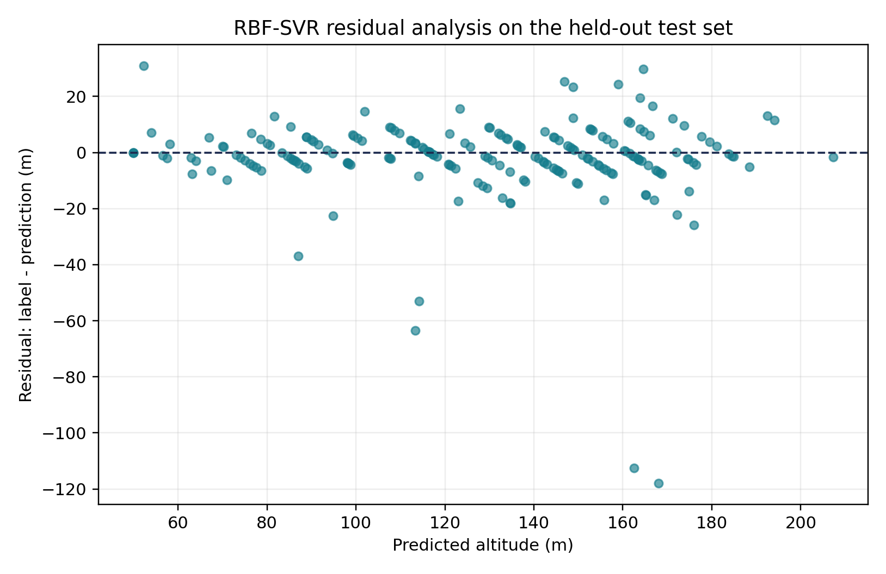
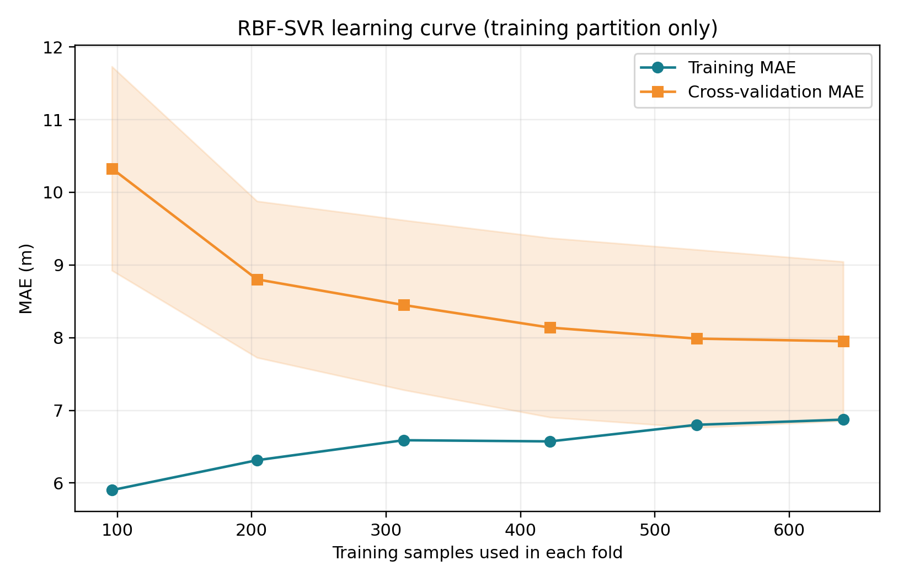
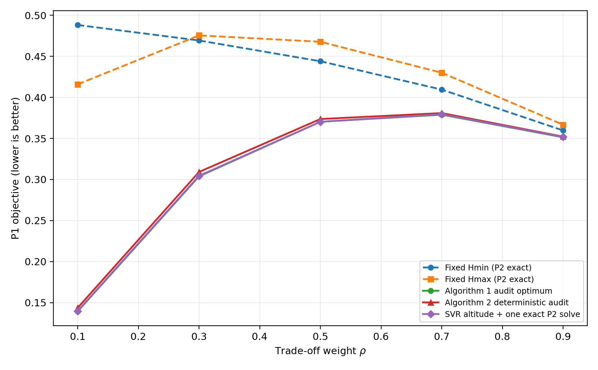
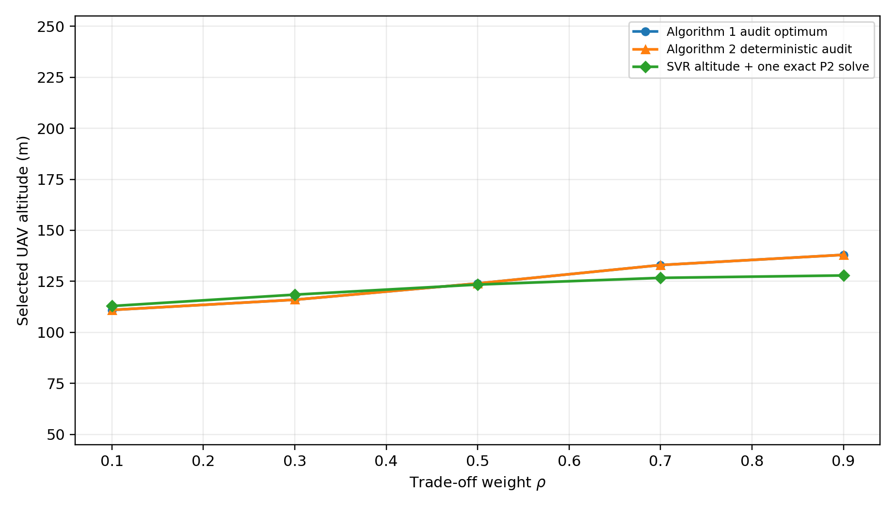

# UAV-ISWPT ML-Assisted Altitude Optimization

Machine-learning-assisted optimization of UAV altitude for an ISWPT (Integrated Sensing, Wireless Power Transfer) system, built as an M.Sc. machine-learning course project.

## Overview

The project studies whether a regression model can stand in for an expensive online altitude search in a UAV-enabled ISWPT system. A UAV carrying an antenna array must pick a hovering altitude that jointly (1) keeps a radar-style sensing beampattern close to a desired shape and (2) delivers enough RF power to two energy-harvesting devices (EHDs) on the ground, trading the two off through a weight `rho`. The underlying system model, objective, and baseline algorithms follow Kang (2024) (see [Reference](#reference-and-attribution)); this repository is an independent reproduction, an ML surrogate on top of it, and an audit of both.

## Engineering Problem and Motivation

Solving the exact per-altitude beamforming problem (`P2|h`) is a convex SDP that is too slow to run at every candidate altitude in a real-time or embedded setting. Kang's paper proposes a PSO-based outer search (Algorithm 1) and a lower-complexity closed-form-assisted search (Algorithm 2) to pick the altitude without exhaustively solving `P2|h` everywhere. This project asks a complementary question: can a regression model, trained on (scenario -> optimal altitude) pairs, predict a near-optimal altitude directly, so that only a single exact solve is needed at the end to confirm/refine it?

## Simplified System Model

- A UAV at altitude `h` carries an `N`-element array and radiates total power `PT`.
- Three angular sensing targets define a desired beampattern `chi`.
- Two EHDs sit at ground ranges `r` and angles `phi` and must each receive at least a quarter of their maximum harvestable power.
- The per-altitude inner problem `P2|h` (fixed `h`) is a convex SDP over the transmit covariance; solving it exactly uses CVXPY. A fast approximate inner solver (FISTA + Dykstra projection) is used for bulk dataset generation and outer-search scans, with the exact SDP reserved for auditing and the final confirmation step.
- The outer problem picks `h` in `[Hmin, Hmax] = [50, 250] m` to minimize the combined objective `P1`, weighted by `rho`.

## Dataset-Generation Pipeline

`notebooks/01_Dataset_Generation.ipynb` is a resumable, physics-only generator (it does not train or inspect any ML model):

1. Sample a random scenario: 3 sorted target angles (>=15 deg apart), 2 EHD ranges/angles, and a trade-off weight `rho`, all from documented distributions, seeded by `90000 + row_index`.
2. Run a deterministic 10-point coarse + 5-point fine altitude search using the fast inner solver to label each scenario with its (approximately) optimal altitude and objective value.
3. Append to `data/ds3.npz` (resumable: reruns continue from the last saved row) and export a human-readable `data/dataset.csv`.
4. No row is accepted, rejected, or modified based on downstream ML performance.

The committed `data/ds3.npz` / `data/dataset.csv` already contain the full 1000-row dataset used for every result in this README; regenerating it is optional and not required to reproduce the ML/audit results.

## ML Models Compared

Four regressors are trained to predict optimal altitude from the 8 scenario features (3 target angles, 2 EHD ranges, 2 EHD angles, `rho`), inside a scikit-learn `Pipeline` with a `StandardScaler` fit only on the training fold:

- Linear Regression
- Decision Tree
- RBF-kernel SVR ("SVR (RBF)")
- MLP (2 hidden layers)

EHD pairs are canonicalised (sorted by range, with each angle kept paired to its own device) before fitting, so the model is not sensitive to arbitrary device-label ordering. Hyperparameters for the tree/SVR/MLP are selected by 5-fold grid search CV on the training partition only (see `scripts/evaluate_ml_corrected.py`); the locked, final hyperparameters are reused everywhere else (repeated-split check, gap-1 benchmark, rendered figures).

## Main Validated Findings

All numbers below are read directly from the committed evidence files (`results/ml/*.json`, `results/gap1/*.json`) and are cross-checked by `scripts/audit/validate_report_claims.py`.

**Regression accuracy, single 80/20 split (seed 42):**

| Model | MAE (m) | RMSE (m) | R² |
|---|---|---|---|
| Linear | 7.96 | 14.45 | 0.859 |
| Decision Tree | 9.91 | 16.98 | 0.805 |
| SVR (RBF) | 7.99 | 15.66 | 0.834 |
| MLP | 8.96 | 15.12 | 0.845 |

**Repeated-split stability (5 seeds: 7, 19, 42, 73, 101), locked hyperparameters:**

| Model | MAE mean (m) | MAE std (m) |
|---|---|---|
| Linear | 8.47 | 0.65 |
| Decision Tree | 10.50 | 0.96 |
| **SVR (RBF)** | **7.88** | **0.67** |
| MLP | 9.41 | 0.90 |

The reported headline number is **RBF-SVR average altitude MAE of approximately 7.88 +/- 0.67 m** across five repeated splits.

**Downstream engineering-objective gap** (fresh "fast candidate oracle," evaluated on the full **200-case held-out test set**, not the training data used to pick a model): for every predicted altitude, the actual `P1` objective is compared against the best objective found over a candidate grid for that same scenario.

| Model | Mean gap (%) | Median gap (%) | p95 gap (%) |
|---|---|---|---|
| Linear | 0.87 | 0.13 | 5.01 |
| Decision Tree | 2.14 | 0.26 | 6.87 |
| **SVR (RBF)** | **0.79** | **0.08** | 3.31 |
| MLP | 1.02 | 0.20 | 4.14 |

So for the best model (SVR (RBF)): **median objective gap of approximately 0.08%, mean objective gap of approximately 0.79%**, over 200 audited test cases. A smaller, independent 20-case subset is additionally re-checked with the *exact* CVXPY solver (`exact_candidate_audit` in `results/ml/ml_corrected_results.json`) rather than the fast solver, as a sanity check on the fast-solver-based gap numbers above.

**Note on the parity figure:** `results/ml/parity_plots.png` shows predictions from one representative 80/20 split (seed 42) and is for visual inspection only. The headline **7.88 +/- 0.67 m** MAE is the *repeated*-split result above and should be treated as the more reliable accuracy estimate; the two are not the same number and should not be conflated.

**Feature importance (SVR, permutation, 30 repeats):** EHD range to the farther device (`r_far`) dominates (+24.9 m MAE when permuted), followed by range to the nearer device (`r_near`, +9.3 m); the trade-off weight `rho` and all four angles contribute comparatively little (<1 m each). See `results/ml/svr_permutation_importance.png`.

## Repository Structure

```text
uav-iswpt-ml-optimization/
|-- README.md
|-- requirements.txt
|-- .gitignore
|-- notebooks/
|   |-- 01_Dataset_Generation.ipynb   # physics-only, resumable dataset generator
|   `-- 02_Complete_ML_Analysis.ipynb # self-contained: writes and runs every module below
|-- src/                              # importable physics/optimization modules
|   |-- kang.py                       # system model, objective, Eq. numbers per the paper
|   |-- fast.py                       # fast FISTA/Dykstra inner solver (P2|h)
|   |-- reference_solver.py           # exact CVXPY SDP inner solver (P2|h), used for audits
|   `-- algorithm2.py                 # Kang Algorithm 2 (Eq. 37/55-56, PSO, deterministic audit)
|-- scripts/                          # result-generating entry points
|   |-- evaluate_ml_corrected.py      # trains/evaluates the 4 models, writes results/ml/
|   |-- repeated_ml_metrics.py        # 5-seed stability check, writes results/ml/
|   |-- render_ml_figures.py          # re-renders ML figures from saved metrics
|   |-- render_svr_diagnostics.py     # SVR residuals + learning curve, writes results/ml/
|   |-- benchmark_gap1.py             # 5-method gap-1 benchmark, writes results/gap1/
|   `-- audit/
|       |-- audit_fast_solver.py      # fast vs. exact solver audit at stored labels
|       |-- audit_label_quality.py    # stored-label vs. exact-search audit
|       |-- verify_gap1.py            # equation/constraint tripwires + PSO repeatability check
|       `-- validate_report_claims.py # machine-checks every number quoted in this README
|-- data/
|   |-- dataset.csv                   # human-readable export of the 1000-row dataset
|   |-- ds3.npz                       # dataset (features X, labels yH/yO)
|   `-- reference/
|       `-- paper_fig3a_digitized.csv # manually digitized from Kang (2024) Fig. 3(a); NOT our results
|-- results/
|   |-- ml/                           # ML evaluation figures + JSON evidence
|   `-- gap1/                         # gap-1 (algorithm benchmark) figures + JSON evidence
|       |-- audits/                   # one-off audit artifacts (not primary reproducible results)
|       `-- expensive_runs/           # saved literal-Algorithm-1-PSO runs (slow, exact CVXPY inner solves)
`-- docs/
    |-- Report.pdf
    `-- Slide.pdf
```

## Installation

```bash
git clone https://github.com/mahdi-aslani-ee/uav-iswpt-ml-optimization.git
cd uav-iswpt-ml-optimization
python -m venv .venv
source .venv/bin/activate   # Windows: .venv\Scripts\activate
pip install -r requirements.txt
```

## Recommended Execution Order

The committed `data/`, `results/ml/`, and `results/gap1/` already hold everything needed to read this README's numbers back out — none of the steps below are required just to inspect results. To regenerate from scratch:

1. *(Optional, expensive, resumable)* `notebooks/01_Dataset_Generation.ipynb` — only if you want to regenerate `data/ds3.npz` / `data/dataset.csv`. Skip this if you're reusing the committed dataset.
2. Either run `notebooks/02_Complete_ML_Analysis.ipynb` top to bottom (it is self-contained: it writes fresh local copies of every module in `src/`/`scripts/` into its own working directory and runs the full pipeline from there), **or** run the standalone scripts directly from the repository root in this order:

```bash
python scripts/evaluate_ml_corrected.py
python scripts/repeated_ml_metrics.py
python scripts/render_ml_figures.py
python scripts/render_svr_diagnostics.py
python scripts/benchmark_gap1.py
python scripts/audit/audit_fast_solver.py
python scripts/audit/audit_label_quality.py
python scripts/audit/verify_gap1.py
```

All scripts resolve `data/`, `src/`, and their own `results/...` output folder relative to the repository root (via `Path(__file__)`), so they can be run from any working directory.

`scripts/audit/validate_report_claims.py` additionally requires a `gap1_outputs_paper_grid/` folder (a Kang-paper-grid comparison) that is **not** produced by any script in this repository — see [Remaining Manual Issues](#remaining-manual-issues-and-open-items) below before running it.

## Main Result Figures

**ML evaluation:**








**Gap-1 benchmark (Algorithm 2 vs. baselines):**




## Supplementary Gap-1 Evidence and Reference Data

Beyond the primary figures/JSON above, `results/gap1/` has two subfolders for evidence that supports the main results but isn't itself a headline number:

- **`results/gap1/audits/`** — one-off audit artifacts, not primary reproducible results:
  - `resolution_audit_rho06.json` — compares the 1-degree vs. 0.1-degree angular-grid results at `rho = 0.6` (objectives at `Hmin`/`Hmax`/audit-optimum/ML-predicted altitude/Algorithm 2, and the relative change from the finer grid). There is no single script that regenerates this exact file.
  - `gap1_results.json` — **not the same file as `results/gap1/gap1_results.json`** despite the identical base name. This one is the Kang-paper-grid comparison (read by `verify_gap1.py` and `validate_report_claims.py` for the "five-method benchmark completeness" check); the top-level `results/gap1/gap1_results.json` is this project's own `benchmark_gap1.py` output. The folder is the only thing distinguishing them — don't confuse the two.
- **`results/gap1/expensive_runs/`** — saved output from a *literal* implementation of Kang Algorithm 1 (the paper's PSO, with an exact CVXPY solve at every particle evaluation — this is what `benchmark_gap1.py --exact-pso` exercises, though these specific files were assembled separately from a normal `benchmark_gap1.py` run rather than being its direct output). Includes `exact_alg1_pso_sweep.json` (read by `verify_gap1.py` and `validate_report_claims.py` for the PSO-repeatability check) and `exact_alg1_pso_rho06.json` (a single `rho = 0.6` run, 73 exact `P2` evaluations).

`data/reference/paper_fig3a_digitized.csv` is **manually digitized reference data from Figure 3(a) of the Kang (2024) paper** (read from a 180-dpi rendering, with an estimated reading uncertainty of approximately ±0.003) — it is **not** an output of this project's own simulation or optimization and must not be read as one; it exists only for visually cross-checking this project's curves against the published figure.

Console output from `scripts/audit/verify_gap1.py` (PASS/FAIL log of the equation tripwires, DCP/DPP checks, PSD and per-antenna constraints, objective consistency, Algorithm 1 repeatability, and five-method benchmark completeness) is intentionally **not** committed — it's fully reproducible by running the script yourself:

```bash
python scripts/audit/verify_gap1.py
```

## Limitations

- All scenarios are simulation-generated (sampled and labeled by the optimizer itself), not field measurements; the dataset does not include any real UAV flight or channel-sounding data.
- The system configuration is fixed to one array size, two EHDs, and one path-loss/LoS model; generalization to other array sizes, EHD counts, or propagation environments is untested.
- The ML model predicts an altitude, not a full beamforming solution — every reported gap already includes one exact (or fast) `P2|h` solve at the predicted altitude, so ML is being used to shrink the outer search, not to replace the inner physical-layer optimization.
- Downstream gap numbers above are computed against a *fast* candidate-oracle grid, not always the exact SDP optimum (only 20 of 200 test cases are cross-checked with the exact solver).
- Further validation under varied channel conditions, EHD placements, and array configurations is needed before any claim of general-purpose applicability.

## Reference and Attribution

The system model, objective (`P1`/`P2|h`), and baseline Algorithms 1/2 follow:

J. Kang, "Joint Design of Transmit Waveform and Altitude for UAV-Enabled ISWPT Systems," *Electronics*, 13(21):4237, 2024.

This repository is an independent implementation of that system model (`src/kang.py`, `src/fast.py`, `src/reference_solver.py`, `src/algorithm2.py`), **not** the original authors' code. The dataset generation, the ML model comparison, all auditing scripts (`scripts/audit/`), and the downstream engineering-objective evaluation are original work for this course project and are not part of the referenced paper. `docs/Report.pdf` and `docs/Slide.pdf` are this project's own report and presentation, not reproductions of the reference paper.
